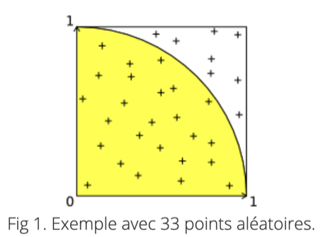

# Cómo estimar pi con el método MonteCarlo
#review/dev/algoritmos

En este ejercicio vamos a calcular una estimación del número π (pi)
 
El método es el siguiente:

Tomamos un punto P al azar de las coordenadas (x,y) de manera que:

 `0 ≤ x ≤ 1` y `0 ≤ y ≤ 1`.
 
 Si `x² + y² ≤ 1`, entonces el punto está dentro del cuadrante del circulo de radio `1`, sino el punto está en el exterior.
 
Sabemos que la probabilidad de que un punto se sitúe en el interior del cuadrante del circulo es igual a `π/4`
 
 Escribe la función 
 
```swift
 approx(pts: [[Double]]) -> Double
```
 
 Que utilizará los puntos `pts` generados al azar para devolver una estimación del número π.
 


### Datos
 
* Cada item de `pts` contiene un punto
* Un punto está representado por un array que contiene exactamente dos números, respectivamente `x` e `y` tal que `0 ≤ x ≤ 1` y `0 ≤ y ≤ 1`
* `pts` contiene siempre al menos un item.

				 
### Solución

Este problema es, en mi opinión, un problema difícil.
 
No sé si fue porque mis matemáticas están algo oxidadas o porque cuando era estudiante no se me daba bien la probabilidad, pero no fui capaz de resolverlo en su momento.
 
Pude resolverlo gracias a la explicación de [Rafael Pérez Laserna][1]
 
Para resolverlo hemos de hacer uso de lo que se conoce cómo método MonteCarlo, que consiste en usar la probabilidad para estimar valores matemáticos (soluciones de ecuaciones, áreas de una curva, etc...).
 
> Se puede decir que es similar a tirar mil dardos en una diana y ver cuales caen dentro y cuales no. *— [Rafael Pérez Laserna][2]*  
>  

Pasos:
 
1. Tenemos una circunferencia de radio 1. Cuya área será igual à π[^1]
2. Rodearemos la circunferencia que queremos estudiar con un polígono de dimensiones conocidas. En este caso de lado 2 (dos veces el radio), por lo que su área será igual a 4[^2]
3. Generaremos al azar puntos dentro de todo el recinto.
4. Las ecuaciones que necesitamos para estimar el valor de π son:

				 
Área dentro de la circunferencia ÷ Área del recinto = Número de puntos dentro de la circunferencia ÷ Puntos totales
 
Entonces tenemos que:
 
π/4 = Puntos dentro/Puntos totales
π = Puntos dentro/Puntos totales \* 4
 
 Los puntos que estarán dentro son aquellos que cumplan la condición `x² + y² ≤ 1`

```swift
import Foundation

func approx(pts: [[Double]]) -> Double {
    var piEstimation = Double()
    var totalPoints = pts.count
    var ptsInside = [[Double]]()
    var ptsOutside = [[Double]]()
    for pt in pts {
        let sum = sumValues(pt)
        if sum <= 1 {
            ptsInside.append(pt)
        } else {
            ptsOutside.append(pt)
        }
    }
    piEstimation = 4 * Double(ptsInside.count) / Double(totalPoints)
    return piEstimation
}

var rands = [[Double]]()
for _ in 0..<1000 {
    let point = [drand48(), drand48()]
    rands.append(point)
}

func sumValues(_ array: [Double]) -> Double {
    var sum = Double()
    for number in array {
        var number = number
        number = pow(number,2)
        sum += number
    }
    return sum
}

print(approx(pts: rands))
```


[^1]:	Área de una circunferencia `C = π*r²`, cómo `r = 1` `C=π*1 = π`
[^2]:	Área de un cuadrado `l²`

[1]:	https://www.youtube.com/watch?v=HL2XdcVPEdQ
[2]:	https://www.youtube.com/watch?v=HL2XdcVPEdQ

#review