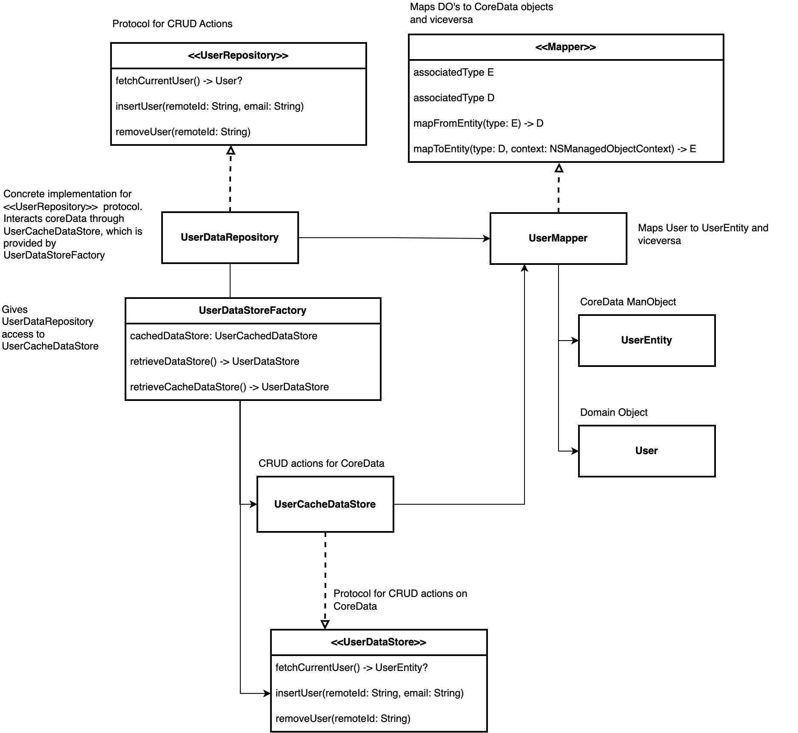

# Implementación de CoreData

#vlabs #dev/coredata #inbox

ref: [[📱 Lista de notas a tomar a partir de las aplicaciones en las que he trabajado]]

No tengo idea de si tiene un nombre, pero este es el patrón que usamos para implementar*CoreData* en uno de los proyectos en los que participé mientras trabajaba en [V-labs](https://v-labs.fr) :



### Principios

Para cada entidad vamos a tener:

- Un `<<EntityRepository>>` que define las CRUD actions para esa entidad
- Una implementación concreta de ese protocolo: `EntityDataRepository`, con dos dependencias:
  1. `UserMapper`
  2. `UserDataStoreFactory`
- `UserMapper` transforma los *DOs* (*Domain Objects*) a *MOs* (*Managed Objects)* y viceversa.
- ` UserDataStoreFactory`, le entrega al `EntityDataRepository` un `<<UserDataStore>>`, que contiene los métodos CRUD para interactuar con *CoreData*.

### Puntos de mejora

Personalmente pienso que es un patrón excesivamente complicado. Hay cosas que no entiendo y otras que haría de otra manera:

#### Mapper 

El protocolo `<<Mapper>>` tiene una dependencia a `NSManagedObjectContext`, por tanto, debería de llamarse  `<<CoreDataMapper>>` porque sólo puede ser utilizado para realizar un mapping hacia entidades de *CoreData* y viceversa.

También creo que sería mejor usar nombres más explícitos para los tipos asociados:

```swift
protocol CoreDataMapper {
	associatedType DomaiObject   // or its contraction DO
	associatedType ManagedObject // or its contraction MO
	
	func mapToMO(from do: DomainObject) -> ManagedObject
	func mapToDO(from mo: ManagedObject, context: NSManagedObjectContext) -> DomainObject
}
```

Como los objetos que implementen el `CoreDataMapper` tienen sólo dependencias en sus métodos, podríamos incluso implementarlos como métodos estáticos, de esta manera no haría falta crear cada implementación para usarlos:

```swift
final class UserCoreDataMapper: CoreDataMapper {
	typealias DomainObject  = User
	typealias ManagedObject = UserEntity

	private init() {}
	static func mapToMO(from do: User) -> ManagedObject {}
	static func mapToDO(from mo: UserEntity, context: NSManagedObjectContext) -> DomainObject {}
}
```

La definición de un *mapper* sería simplemente un *namespace* para los métodos de *mapping*. Uso:

```swift
let mo = UserCoreDataMapper.mapToMO(from: user)
let do = UserCareDataMapper.mapToDO(from: mo, context: context)
```

Para hacer el *mapping* de objetos, prefiero usar el método descrito en el artículo [Core Data and Async Await — Thread Safe](https://agiokas.medium.com/core-data-and-async-await-thread-safe-f96b6dbbb7c4), que consiste en la implementación de un protocolo `ToSafeObject` al que conformar  las entidades `CoreData`:

```swift
protocol ToSafeObject {
	associatedType SafeType
	func toSafeObject() throws -> SafeType
}

extension UserEntity: ToSafeObject {
	typealias SafeType = User
	func toSafeObject() throws -> User {}
}

// Usage
let user = try? userEntity.toSafeObject()
```

#### UserDataStoreFactory, UserCachedDataStore y UserDataStore

No entiendo por qué el `UserDataStoreFactory` tiene una dependencia al protocolo `UserDataStore` y a su implementación concreta `UserCachedDataStore`.

Tampoco entiendo porqué es necesario pasar por este objeto intermedio, en lugar de pasarle al repositorio directamente el `UserCachedDataStore` , que es el que tiene la dependencia al `NSManagedObjectContext` y por tanto quién interactúa directamente con *CoreData*

No sé cual es la ventaja de tanto objeto. Tampoco creo que sea necesario inyectar un objeto específico de la entidad de usuario, sino que podemos pasar directamente un manager global que se ocupe de todas las entidades, ya que el dominio de la app es pequeño y hay pocas entidades:

```swift
final class UserRepository {
	
	let manager: PersistencyManager

	func fetchCurrentUser() -> User? {
		manager.fetchCurrentUser()
	}
}
```

Definición:

```swift
protocol PersistencyManager {
	// MARK: - C
	func createUser(id: String, email: String) async throws
	func createSession(repetitions: Int) async throws
	
	// MARK: - Read
	func readUsers() async throws -> [User]
	func readSessions() async throws -> [Session]

	func readUser(id: String) async throws -> User
	func readSession(id: UUID) async throws -> Session

	// MARK: - Update
	func update(user: User) async throws
	func update(session: Session) async throws
	
	// MARK: - Delete
	func deleteUser(id: String) async throws
	func deleteSessino(session: Session) async throws
}

// MARK: - CRUD actions
final class CoreDataManager: PersistencyManager {

	let context: NSManagedObjectContext

	// MARK: - C
	func createUser(remoteId: String, email: String) async throws {}
	func createSession(_ s: Session) async throws {}
	
	// MARK: - Read
	func readUsers() async throws -> [User] {}
	func readSessions() async throws -> [Session] {}
	func readUser(remoteId: String) async throws -> User {}
	func readSession(id: UUID) async throws -> Session {}

	// MARK: - Update
	func update(user: User) async throws {}
	func update(session: Session) async throws {}
	
	// MARK: - Delete
	func deleteUser(remoteId: String) async throws {}
	func deleteSessino(session: Session) async throws {}
}
```

Nótese que en esta implementación el `PersistencyManager` devuelve directamente los objetos de dominio y no los objetos `CoreData` en los métodos de lectura. Esto es necesario para que podamos implementar cualquier otra solución de persistencia.

La consecuencia es que el *mapping* de objetos de la solución de persistencia (en este case CoreData) a objetos de dominio es responsabilidad del objeto que implemente `PersistencyManager`,  ya sea a través de un objeto `CoreDataMapper` o cualquier otra forma.

También los utiliza para actualizar la entidad de *CoreData*: En lugar de tener un método para cada posible propiedad a actualizar, le pasamos el *DO* ya actualizado, e igualamos todas las propiedades.

```swift
 public func update(user: User) async throws {
        let entity: UserEntity? = try await context.get(id: user.id)
        try await context.perform {
            guard let entity = entity else {
                throw CoreDataError.entityNotFound
            }
            
            entity.email = user.email
            entity.firstName = user.firstName
           	entity.lastName = user.lastName
            try context.save()
        }
 }
```


Como digo en la nota [[2023-05-13 Clon de Things/Modularización]], no tengo idea de si esto a la larga (con modelos muy grandes) conlleve problemas de desempeño (por eso de actualizar todo de golpe, en lugar de sólo lo necesario). Para cambios tan nimios, seguro que no hay problema, pero para estar más seguros, podríamos hacer algo como esto:


```swift
 public func update(user: User) async throws {
        let entity: UserEntity? = try await context.get(id: user.id)
        try await context.perform {
            guard let entity = entity else {
                throw CoreDataError.entityNotFound
            }
            
            if entity.email != user.email {
				entity.email = user.email
			}

			if entity.firstName = user.firstName {
				entity.fistName = user.firstName
			}

           	if entity.lastName = user.lastName {
				entity.lastName = user.lastName
			}
            try context.save()
        }
 }
```

Incluso, ¡acabo de caer mientras escribo!:  ¡Se puede usar la propiedad `hasChanges` del contexto!:

```swift
 public func update(user: User) async throws {
        let entity: UserEntity? = try await context.get(id: user.id)
        try await context.perform {
            guard let entity = entity else {
                throw CoreDataError.entityNotFound
            }
            
            entity.email = user.email
            entity.firstName = user.firstName
           	entity.lastName = user.lastName
            try context.saveIfNeeded()
        }
 }

extension NSManagedObjectContext {
	func saveIfNeeded() throws {
		if hasChanges { try save(} }
	}
}
```

En conclusión, para cada repositorio, podríamos simplemente inyectar el mismo `CoreDataManager`:

```swift
let userRepo    =    UserRepository(manager: container.manager)
let sessionRepo = SessionRepository(manager: container.manager)
```
k